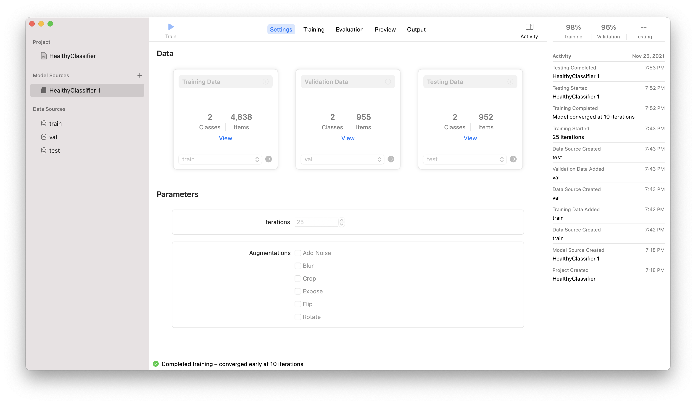
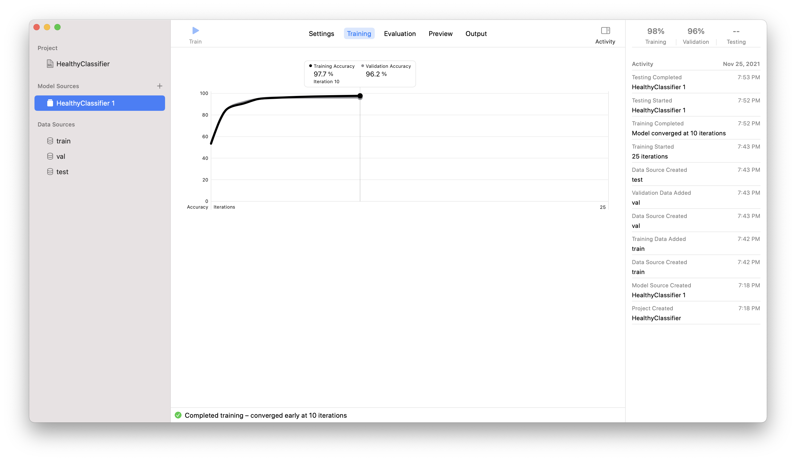
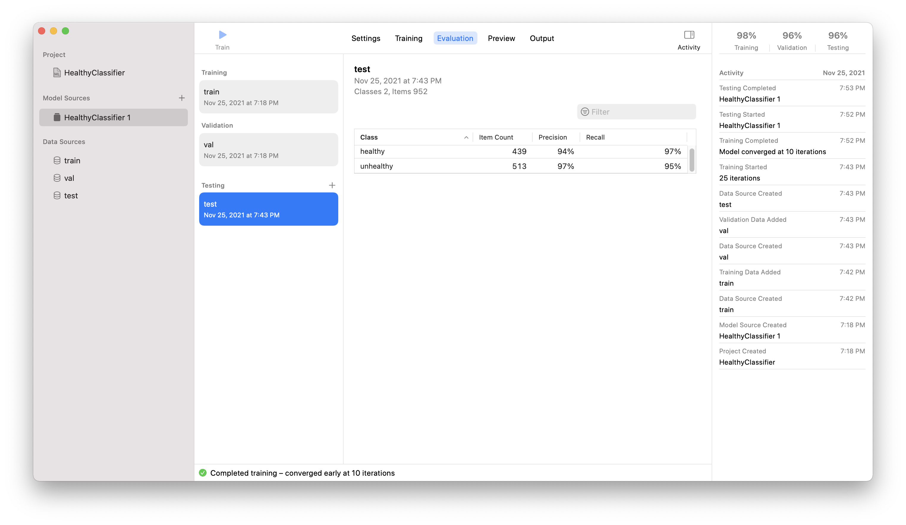
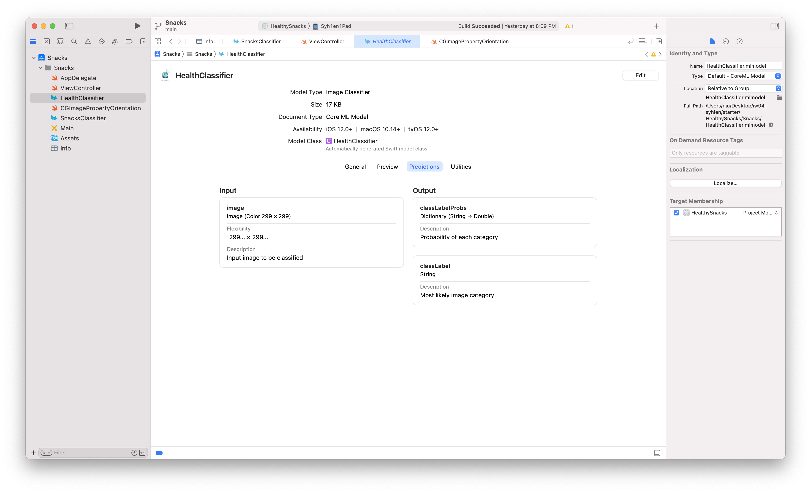

# iw04 卷积神经网络图形识别

[Demo视频](https://www.bilibili.com/video/BV1cU4y1T748/)

## 简述

基于模版工程，运用CoreML开发一个利用卷积神经网络分类snacks的app

- 拍照或选择相册中的图片
- 对图片分出类别及是否健康
- 显示分类结果及置信度
- 对于不确定或数据集以外的图片，给出`Not sure`的判断

## 技术实现

### CoreML训练模型

这里以给分健康与不健康的`HealthyClassifier`为例：



使用了给定的数据集进行训练。我做了几次加入`augmentations`的训练，发现效果还不如不加，所以最终使用的模型训练时没额外加augmentation



训练在第10次迭代的时候结束了



使用给定的测试集进行测试，发现准确率还是挺可观的

将模型导出并加入到xcode项目后，xcode会自动生成其对应的class



可以看到，要求输入一个299*299大小的图片，输出一个类别及其可能性的字典

这个输入的格式意味着我们需要在每次使用模型前预处理一下图片

### 在代码中使用模型

想要在代码中用上我们训练的模型，首先需要导入一些依赖：

```swift
import CoreML
import Vision
```

接着我们需要扩展`viewController`让它有处理图像识别请求的能力：

```swift
extension ViewController {
    func processObservations(for request: VNRequest, error: Error?) {
        if let results = request.results as? [VNClassificationObservation] {
            if results.isEmpty {
                self.resultsLabel.text = "Nothing found"
            } else {
                let result = results[0].identifier
                let confidence = results[0].confidence
                if confidence < 0.8 {
                    if self.resultsLabel.text?.isEmpty == false {
                        self.resultsLabel.text! += "\n"
                    }
                    self.resultsLabel.text! += "It is " + result + "? Not sure"
                } else {
                    if self.resultsLabel.text?.isEmpty == false {
                        self.resultsLabel.text! += "\n"
                    }
                    self.resultsLabel.text! += result
                    self.resultsLabel.text! += " - "
                    self.resultsLabel.text! += String(format: "%.1f%%", confidence * 100)
                    print(result)
                }
            }
        } else if let error = error {
            self.resultsLabel.text = "Error: \(error.localizedDescription)"
        } else {
            self.resultsLabel.text = "???"
        }
        self.showResultsView()
    }
}
```

接着我们需要一个能够封装我们请求的东西：

```swift
class ViewController: UIViewController {
    lazy var classificationRequest: VNCoreMLRequest = {
        do{
            let classifier = try SnacksClassifier(configuration: MLModelConfiguration())
            let model = try VNCoreMLModel(for: classifier.model)
            let request = VNCoreMLRequest(model: model, completionHandler: {
                [weak self] request,error in
                self?.processObservations(for: request, error: error)
            })
            request.imageCropAndScaleOption = .centerCrop
            return request
        } catch {
            fatalError("Failed to create request")
        }
    }()
```

`classifier`就是我们的识别图像的类，`model`就是其中的模型，`request`是一次图像识别的请求

接着，在想要进行识别的地方进行调用即可（当然，输入需要预处理好）：

```swift
let handler = VNImageRequestHandler(cvPixelBuffer: pixelbuffer)
let healthHandler = VNImageRequestHandler(cvPixelBuffer: pixelbuffer)
do {
    self.resultsLabel.text! = ""
    try handler.perform([self.classificationRequest])
    try healthHandler.perform([self.healthClassificationRequest])
} catch {
    print("Failed to perform classification: \(error)")
}
```

### 图片处理

模型对图片有两个要求：

1. 尺寸为299*299

解决方案：缩放图片

2. 输入类型为`CVPixelBuffer`

解决方案：将`UIImage`转换成`CVPixelBuffer`再送入

我的方法是，给`UIImage`类扩展两个方法：

```swift
extension UIImage {
    func scalePreservingAspectRatio(targetSize: CGSize) -> UIImage {
            // Determine the scale factor that preserves aspect ratio
            let widthRatio = targetSize.width / size.width
            let heightRatio = targetSize.height / size.height
            
            let scaleFactor = min(widthRatio, heightRatio)
            
            // Compute the new image size that preserves aspect ratio
            let scaledImageSize = CGSize(
                width: size.width * scaleFactor,
                height: size.height * scaleFactor
            )

            // Draw and return the resized UIImage
            let renderer = UIGraphicsImageRenderer(
                size: scaledImageSize
            )

            let scaledImage = renderer.image { _ in
                self.draw(in: CGRect(
                    origin: .zero,
                    size: scaledImageSize
                ))
            }
            
            return scaledImage
        }
    
    func toCVPixelBuffer() -> CVPixelBuffer? {
        let attrs = [kCVPixelBufferCGImageCompatibilityKey: kCFBooleanTrue, kCVPixelBufferCGBitmapContextCompatibilityKey: kCFBooleanTrue] as CFDictionary
        var pixelBuffer : CVPixelBuffer?
        let status = CVPixelBufferCreate(kCFAllocatorDefault, Int(self.size.width), Int(self.size.height), kCVPixelFormatType_32ARGB, attrs, &pixelBuffer)
        guard status == kCVReturnSuccess else {
            return nil
        }

        if let pixelBuffer = pixelBuffer {
            CVPixelBufferLockBaseAddress(pixelBuffer, CVPixelBufferLockFlags(rawValue: 0))
            let pixelData = CVPixelBufferGetBaseAddress(pixelBuffer)

            let rgbColorSpace = CGColorSpaceCreateDeviceRGB()
            let context = CGContext(data: pixelData, width: Int(self.size.width), height: Int(self.size.height), bitsPerComponent: 8, bytesPerRow: CVPixelBufferGetBytesPerRow(pixelBuffer), space: rgbColorSpace, bitmapInfo: CGImageAlphaInfo.noneSkipFirst.rawValue)

            context?.translateBy(x: 0, y: self.size.height)
            context?.scaleBy(x: 1.0, y: -1.0)

            UIGraphicsPushContext(context!)
            self.draw(in: CGRect(x: 0, y: 0, width: self.size.width, height: self.size.height))
            UIGraphicsPopContext()
            CVPixelBufferUnlockBaseAddress(pixelBuffer, CVPixelBufferLockFlags(rawValue: 0))

            return pixelBuffer
        }

        return nil
    }
}
```

- `scalePreservingAspectRatio`返回一个缩放至给定的`CGSize`尺寸的`UIImage`：

```swift
let scaledImage = image.scalePreservingAspectRatio(targetSize: CGSize(width: 299, height: 299))
```

- `toCVPixelBuffer`返回自身的`CVPixelBuffer`转换结果：

```swift
let pixelbuffer = scaledImage.toCVPixelBuffer()
```

### 改造数据集

我本来以为数据集会需要什么很复杂的工作，后来发现数据集其实就是类别为名字的文件夹下放对应的图片

按照自己的理解将食物分为健康和不健康并丢入`healthy`和`unhealthy`两个文件夹，即可用来训练模型

验证数据集和测试数据集也是同样的改造方法

我改造的数据集可以在[snacks health dataset](https://github.com/syhien/snacks-health-dataset/)看到

